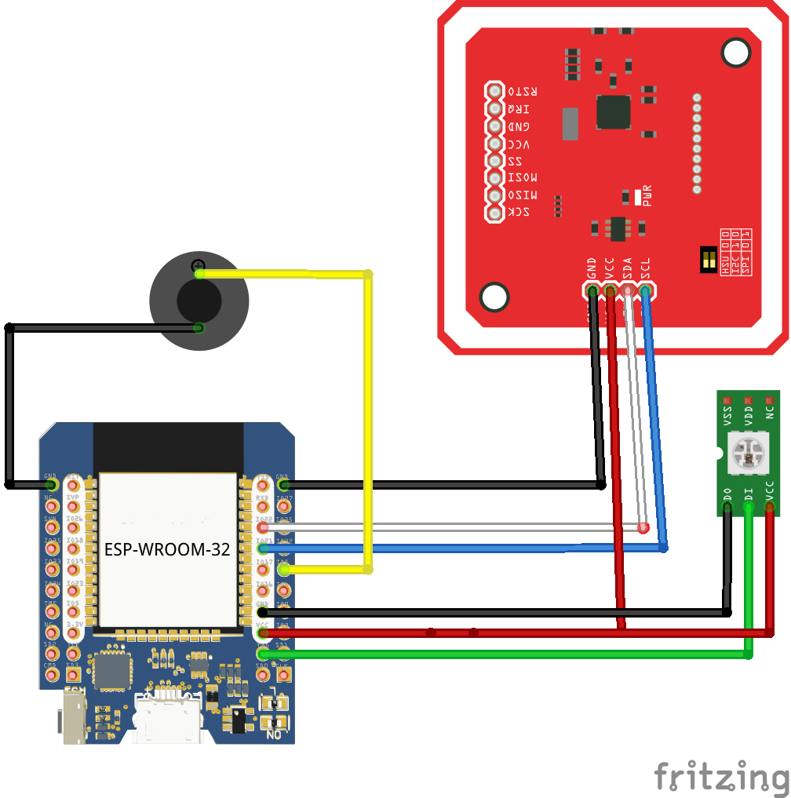
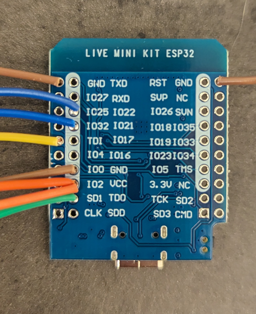
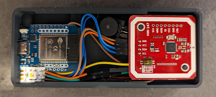
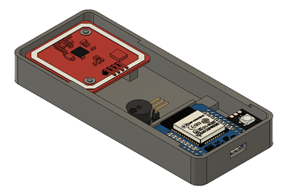

Credits to adonno for the great work [anonno tagreader](https://github.com/adonno/tagreader)  

# Tag Reader for Home Assistant

The tag reader is a simple to build/use NFC tag reader, specially created for [Home Assistant](https://www.home-assistant.io). It is using a esp32 and the PN532 NFC module. The firmware is built using [ESPhome](https://www.esphome.io).

## Building the tag reader

To build your own tag reader, you need the following components:

 - esp32 (in my case: D1 ESP32 Mini Wroom USB-C)
 - PN532 NFC Reader
 - WS2812 Led
 - Piezo Buzzer (KY-012)

### Connecting the components

Also, make sure that you have set the switches on the PN532 to utilize I2C the following:
- Switch 1: On (up)
- Switch 2: Off (down)

This enables the PN532 module to communicate with the GPIO21/22 over I2C, and is required for the modules to work together!

The adjusted 3D models for the case are [here](STLs).
Available as Multicolor STL & 3MF. Prints on a bambu Lab in 2h 25min. (Lid, base & storagebox)

## Configuring for use with Home Assistant

The tag reader requires [Home Assistant](https://www.home-assistant.io) 0.115 or later.

If the tag reader is unable to connect to a wifi network, it will start a WiFi access point with a captive portal to allow you to enter your WiFi credentials.

The tag reader will be automatically discovered by Home Assistant once the tag reader is connected to the same network. You can follow the instructions in the UI to set it up.

## Usage

Scanned tags can be managed from the tags interface in Home Assistant. You can find it under config -> tags.

